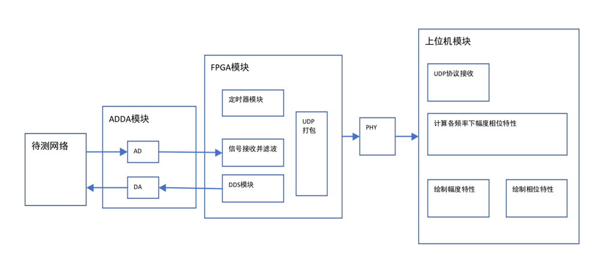
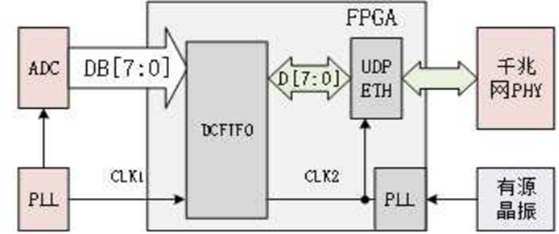
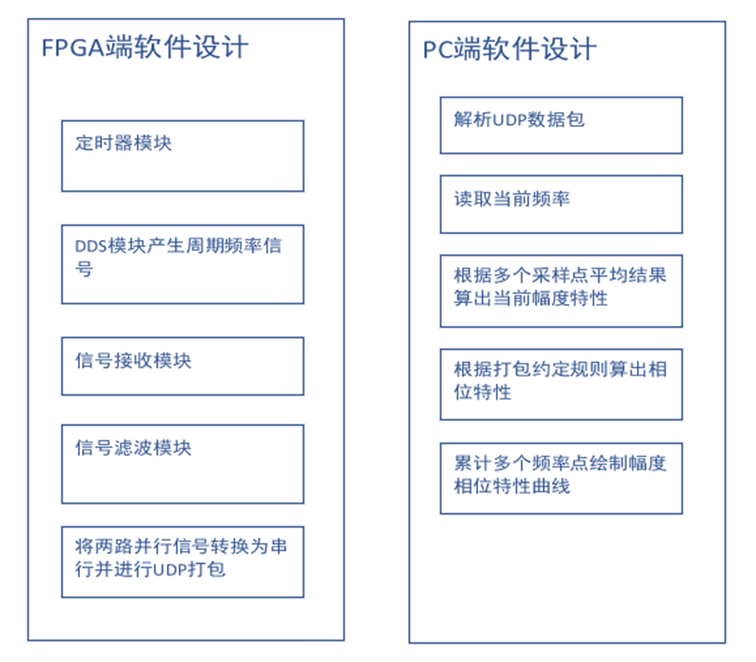
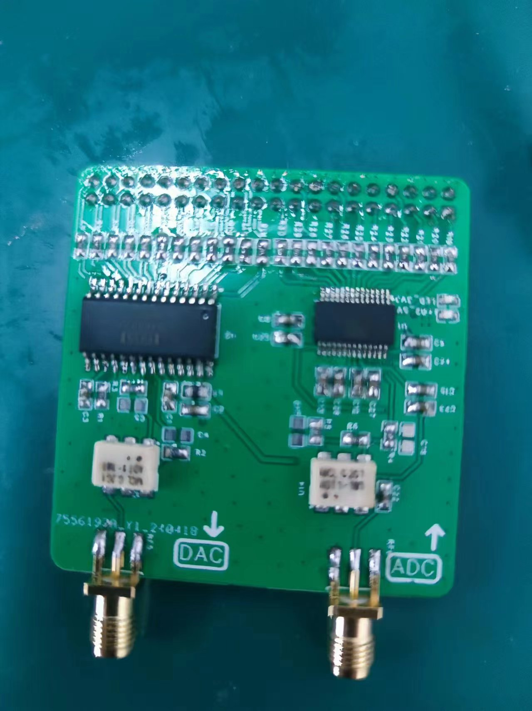

# **简易频率特性测试仪设计** 

**<u>（具体方案见项目报告，以下仅简略展示结构）</u>**

课题要求基于FPGA设计并实现简易频率特性测试仪，频率特性测试仪是一种用于测量电路、系统或设备在不同频率下的响应特性的仪器。它在电子工程和通信领域中具有重要的意义和应用。

**要求设计的频率特性测试仪能够通过FPGA端对于原始信号和过网络信号进行实时采集，通过UDP以太网传输协议与PC端连接传输数据，并能够在PC端的对应程序实时显示信号的频率特性和相位特性。**

对于硬件模块，要求达到以下性能指标：

1.信号范围：500K~10M频率范围的电路网络；

2.FPGA具备产生多种波形的信号输出； 

4.与PC端实时通信传输信号

5.按规范设计3D打印、电路原理图、PCB。

 对于PC端程序的设计要求：

1.能够接收FPGA发送的数据包，加入错误检测和重传请求，确保数据的准确性和完整性。

2.将接收到的原始数据按照预定格式进行解码，转换成可用的测量数据，对解码后的数据进行数学运算处理。

3.实时显示采集信号的频率特性和相位特性曲线，能够显示波形中各个采样点的频率信息。

4.具备数据库管理功能，可以对于采集输入进行导入备份和数据管理。

5.设计直观的用户界面展示实时测量数据，UI设计合理美观，便于上手操作。

6.考虑兼容性和并发性，确保软件可以在主流操作系统上运行，支持多线程接收处理数据。

# 模块设计结构图

# FIFO模块设计逻辑

# 主程序流程图

# 最终成品（PCB）

